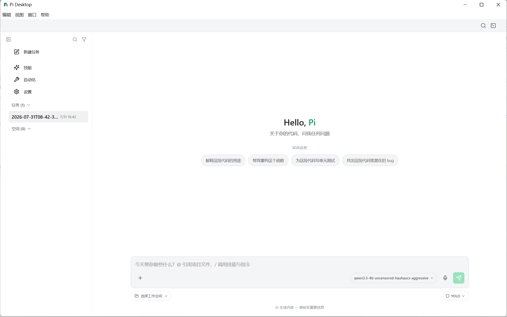

# Pi Desktop

> [English] | **中文 [README](README.md)**

> A desktop shell for the [Pi Agent](https://pi.dev) — native windows, an integrated terminal, and a multi-session workspace built with Electron.

Pi Desktop is a desktop client for Pi, the AI coding agent. It never modifies any source of the Pi SDK (`@earendil-works/pi-coding-agent` stays untouched and can be freely upgraded via npm); it only provides a comfortable desktop interaction layer: sidebar session management, an integrated terminal, parallel tasks across workspaces, a system tray, and automatic updates.



## Features

- **Parallel sessions**: tasks in different workspaces run concurrently; the sidebar groups sessions into "任务 (Tasks)" and "空间 (Spaces)".
- **Integrated terminal**: a real PTY terminal (node-pty) with Git Bash / PowerShell / Cmd; it stays mounted alongside the main view — closing it just hides it, output is never lost.
- **In-session search**: search box in the title bar, matches and highlights across all message content and thinking blocks.
- **Context management**: manual `/compact` plus auto-compaction, with configurable keep-window / trigger thresholds.
- **Tool execution visualization**: tool calls show name + argument summary inline; expand to see full JSON and output.
- **Tool activation config**: check the Pi built-in tools (read / bash / edit / write / grep / find / ls) in settings.
- **File management**: browse the workspace from a sidebar file manager, search files, preview contents; reference files with `@` in chat to attach them as cards sent along with your message.
- **Soul persona**: edit persona in settings, injected at the very bottom of the system prompt, hot-reloaded every turn.
- **Security center**: bash dangerous-command blacklist / whitelist, confirmation dialog for sensitive commands (isolated per workspace).
- **IM gateway**: chat with the AI from your phone via DingTalk / WeChat / QQ bots — text, images, voice, slash commands, command approval, and scheduled-task result push (see [IM Gateway](#im-gateway-dingtalk--wechat--qq)).
- **System tray**: clicking X minimizes to the tray; left-click toggles the window, right-click menu to quit.
- **Auto-update**: electron-updater against Gitee (primary) / GitHub (mirror); users upgrade automatically after each release.
- **Session export**: export a session to a standalone HTML file.

## Tech Stack

| Layer | Tech |
|---|---|
| Desktop framework | Electron 35+ |
| Frontend | React 19 + TypeScript + Vite |
| State | Zustand |
| Terminal | node-pty + xterm.js |
| Agent engine | [@earendil-works/pi-coding-agent](https://www.npmjs.com/package/@earendil-works/pi-coding-agent) (read-only, never patched) |
| Updates | electron-updater (generic provider) |

## Project Structure

```
src/
├── main/            # Electron main process
│   ├── index.ts     # entry: window + tray + updater + IPC
│   ├── window.ts    # main window (close = hide to tray)
│   ├── tray.ts      # system tray
│   ├── app-updater.ts  # auto-update
│   ├── menu.ts      # application menu
│   ├── ipc-handlers.ts
│   └── pi/          # Pi SDK integration (session-manager / terminal-manager / soul …)
├── preload/         # secure bridge (contextIsolation)
├── renderer/        # React UI (chat / sidebar / layout / store)
└── shared/          # shared code (i18n, …)
resources/           # icons (official Pi logo)
scripts/publish.mjs  # publish script (Gitee + GitHub, contains tokens — gitignored)
```

## Development

```bash
npm install
npm run dev          # starts vite + Electron with hot reload
```

## Build & Package

```bash
npm run build            # compile only (renderer tsc + vite output to dist/)
npm run build:electron   # full package: main-process tsc check + electron-builder → release/
```

Windows artifacts (per `electron-builder.yml`): NSIS installer + portable exe.

## macOS Build (must run on macOS)

Windows **cannot cross-compile** macOS installers (dmg can only be built on macOS). To build on a Mac:

**Prerequisites**

- Node.js 22.x + npm (Pi SDK requires `engines.node >= 22.19.0`)
- Xcode Command Line Tools: `xcode-select --install`
- (Optional) Apple Developer certificate for signing & notarization — unsigned builds work, but macOS Gatekeeper will block first launch (right-click → Open to bypass)

**Build**

```bash
npm install
npm run build:electron   # produces .dmg + .zip under release/
```

> node-pty ships prebuilt darwin-arm64 / darwin-x64 binaries (N-API), so `npm install` on macOS skips compilation; if you hit compile errors, check Xcode CLT.

## IM Gateway (DingTalk / WeChat / QQ)

Configure bots on the **"IM Gateway"** page and chat with the AI from your phone. IM sessions appear in the desktop sidebar, can be continued there, and can be bound / migrated to any workspace.

| Channel | How to connect | Credentials |
|---|---|---|
| **DingTalk** | internal-org robot (Stream long connection, no public callback URL) | AppKey + AppSecret |
| **WeChat** | **QR scan login** (official iLink protocol, no AppID/AppSecret) | phone WeChat scan |
| **QQ** | **QR scan login** (official bot SDK) | phone QQ scan (writes AppID + AppSecret automatically) |

Capabilities: text / image (multimodal) / voice (server-side ASR) / file sending & receiving, quoted-message context, streaming replies (DingTalk AI cards, QQ typewriter), slash commands (`/model` `/status` `/compact` `/reset` ...), **channel command approval** (QQ inline buttons; text commands `/allow` `/deny` `/allow_always` or `allow:1` on DingTalk/WeChat — channel approval overrides the desktop global mode, the danger blacklist is always enforced), "allow & remember" whitelisting, and **scheduled-task result push** to a chosen channel.

## Runtime Config (Windows: `~/.pi/agent/` · macOS: `~/Documents/PiAgent/`)

Shared config directory between the Pi SDK and the desktop shell (on macOS it lives under Documents so Finder shows it; Windows keeps the hidden `~/.pi/agent`):

| File | Purpose |
|---|---|
| `settings.json` | default model / provider, `activeTools`, `compaction` params |
| `auth.json` | API keys per provider |
| `custom-models.json` | custom OpenAI-compatible endpoints (LM Studio / Ollama, …) |
| `soul.md` | persona (edited from settings) |
| `chat/` | sessions without a workspace |
| `sessions/` | session history per workspace (JSONL) |

## Requirements & Installation

### System Requirements

| Platform | Minimum |
|---|---|
| Windows | Windows 10+ (x64 / arm64) |
| macOS | macOS 12+ (Intel / Apple Silicon) |

### Installation

Download the installer from [Releases](https://github.com/lijian-ui/Pi-DeskTop/releases). The update source is Gitee (faster in China); GitHub is the mirror.

- **Windows NSIS installer**: double-click the `.exe` → install wizard
- **macOS DMG**: double-click the `.dmg` → drag into Applications

**First-launch signing warnings** (unsigned builds):

- Windows: SmartScreen says "Unknown publisher" → click "More info" → "Run anyway"
- macOS: Gatekeeper blocks → right-click → Open → confirm

Removing these warnings requires a code signing certificate (a few hundred USD/year). Current releases are unsigned — that's normal for development.

### Data & Uninstallation

- All sessions / settings / persona live in the config directory (Windows: `~/.pi/agent/`; macOS: `~/Documents/PiAgent/`, see previous section)
- **Uninstalling the app does NOT delete the config directory** — reinstalling keeps your history, settings, and persona
- **Full purge**: manually delete the config directory (Windows: `%USERPROFILE%\.pi\agent\`; macOS: `~/Documents/PiAgent/`)

## FAQ

**Can I chat without a workspace?** Yes. Regular chats land in the `chat/` subfolder of the config directory (sidebar group "任务"); you can bind a workspace before sending the first message (group "空间").

**How do I upgrade the Pi SDK?** `npm install @earendil-works/pi-coding-agent@<new-version>` (for 0.x versions `^` only locks patches — cross-minor upgrades require an explicit version), then `npm run build` to verify.

**Clicking the close button doesn't quit?** Correct — X minimizes to the system tray; use the tray right-click menu "退出" to quit.

## License

MIT
